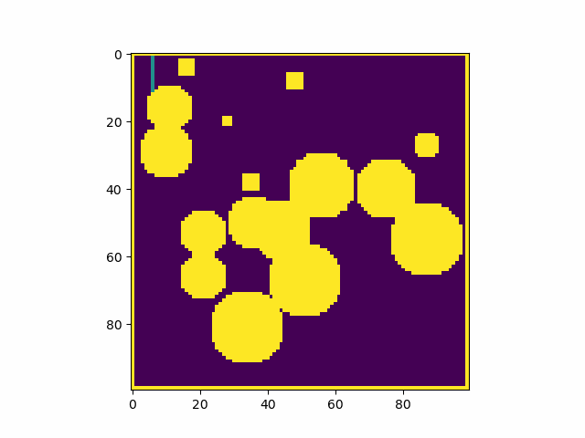
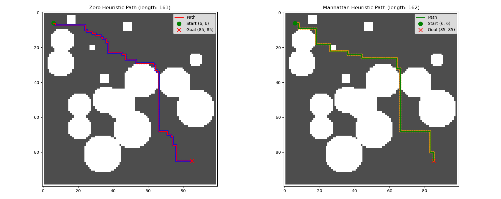

# AStar Path Planning Library - Build Instructions

## Prerequisites

- C++17 compatible compiler
- Python 3.6+ with development headers
- Eigen3 3.3 or higher
- PyBind11

## Installation Steps

### 1. Install Dependencies

**Ubuntu/Debian:**
```bash
```

### 2. Build the Library

```bash
# Create build directory
mkdir build
cd build

# Configure with CMake
cmake ..

# Build the project
make
```

### 3. Deploy the Python Module

After successful compilation, copy the generated shared library to your project directory:

```bash
# Copy the compiled library to your notebook directory
cp astar_planner*.so /path/to/your/project/
```

The library file will be named similar to:
- `astar_planner.cpython-312-x86_64-linux-gnu.so` (Linux)

Place the `.so` file in the same directory as your `main.ipynb` notebook

## Project Structure

```
your_project/
├── main.ipynb
├── astar_planner.cpython-312-x86_64-linux-gnu.so  # ← Place here after build
├── discreate_planning_lib/
|   ├── CMakeLists.txt
|   ├──include/
│       ├── AStar_planner.hpp
│       ├── AStar_interface.hpp
│       └── Wrapper.hpp
|   ├── src/
│       ├── AStar_interface.cpp
│       ├── AStar_planner.cpp
│       └── Wrapper.cpp
└   ├──  build/                    # ← Build directory
```

The library provides path planning for 2d-object with orientation constraints.

## Result





